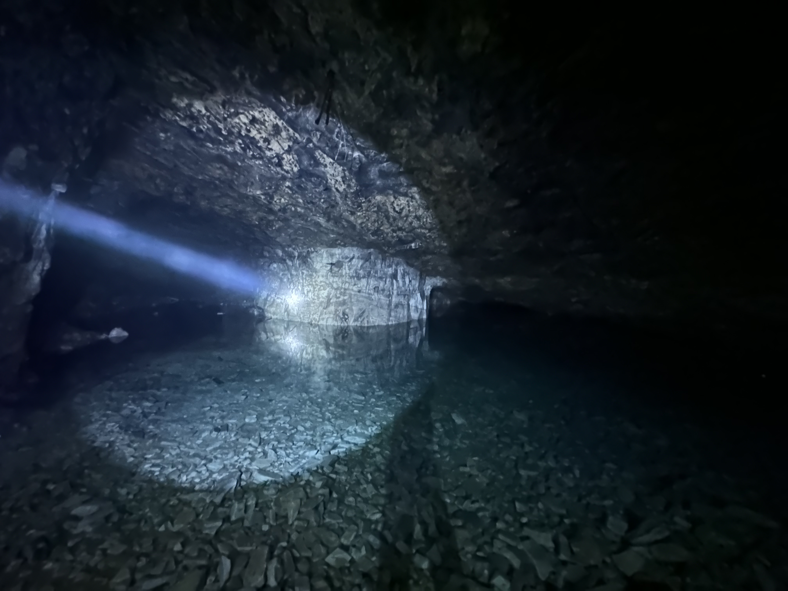

常用emoji

⭐⭐⭐⭐⭐ ✅➡️

😍🤪👍👈👉👅🌟🔥🌈🥥🍍🍉🍓🍞🥨🍳🍔🥪🥘🍜🍲🍛🍤🥟🍱🍧🍨🧁🍰🍮🥂🍹🥢🍽🎉🎈📍📌1️⃣2️⃣3️⃣4️⃣5️⃣6️⃣7️⃣8️⃣ ✅➡️❌
符号

「」

最近在找找北京周边有什么好玩的，发现了这个非常神奇的地方。
📌地点：聚仙洞在房山这边，要来的话，基本上只能开车，直接导航过来就行；
🅿️停车：非常好停车，可以直接把车开到山洞里。

🍲吃火锅：可以来吃个火锅，老板人很好，而且火锅价格也不贵，大老远吃一个也挺好。这里的蘑菇是特色，有很多种，人多的话，可以多尝试一些。

👉玩：当然来这里最主要的还是去山洞探险，这里真的是非常的神奇，这里的山洞是很早之前的矿洞，已经荒废了很多年了，里面有非常多的支线，个人建议不要太过于深入，里面已经有灯光了，按照灯光走，基本上就是最核心的观赏点了，胆子小的话，按照老板设定的灯光肯定是没错的。
胆子大的话，可以稍微往里走走，我自己走的时候，感觉还是比较渗得慌，主要是彻底的黑，完全一丢丢光线都没有黑，所以一定要带强光手电筒，而且要直射的那种。
另外就是这里的洞顶都在渗水，能听到到处滴水的声音，这个如果在没人，且完全黑暗的情况下，周围到处是这种声音，还是有些恐怖的。
⌚ 耗时：慢点走，好奇心重的话，差不多一个小时吧，如果只是按照路线，估计就更快了。

总之，来吃个火锅，探个险，真的是非常值得了。

---
![[IMG_3486.jpeg]]
-

-
-

-

--
!(IMG_3486.jpeg)

